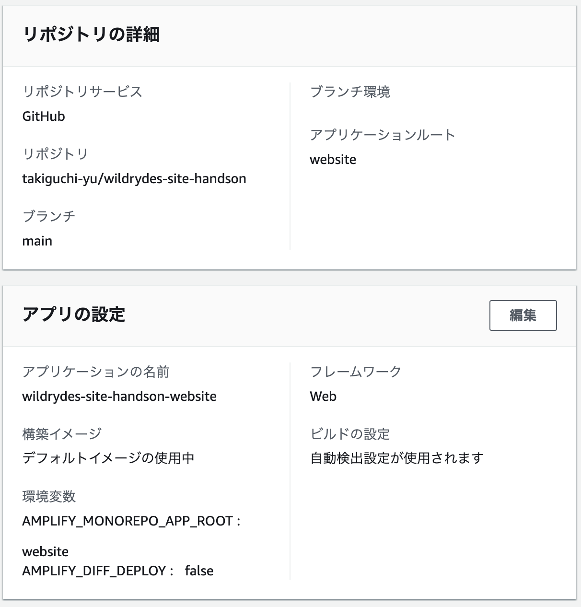
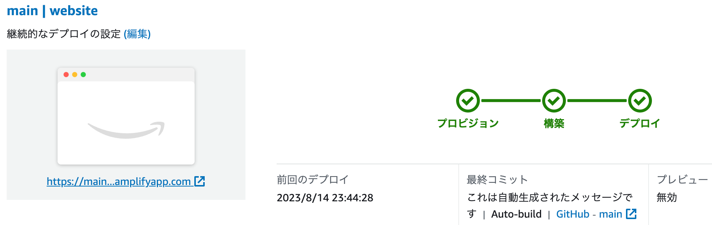

# wildrydes-site-handson

サーバーレスのウェブアプリケーションを構築するハンズオン

<!-- @import "[TOC]" {cmd="toc" depthFrom=1 depthTo=6 orderedList=false} -->

<!-- code_chunk_output -->

- [wildrydes-site-handson](#wildrydes-site-handson)
- [アプリケーションのアーキテクチャ](#アプリケーションのアーキテクチャ)
- [モジュール](#モジュール)
  - [静的ウェブサイトをホストする（AWS Amplify）](#静的ウェブサイトをホストするaws-amplify)
  - [ユーザーを管理する（Amazon Cognito）](#ユーザーを管理するamazon-cognito)
  - [サーバーレスバックエンドを構築する](#サーバーレスバックエンドを構築する)
  - [RESTful API をデプロイする](#restful-api-をデプロイする)
- [参考資料](#参考資料)

<!-- /code_chunk_output -->

# アプリケーションのアーキテクチャ


# モジュール

## 静的ウェブサイトをホストする（AWS Amplify）

継続的デプロイのビルトインでウェブアプリケーションの静的リソースをホストするように AWS Amplify を設定する。

- ソースコードを S3 から持ってくる。持ってきたらソースコードを github に push する。

```sh
aws s3 cp s3://wildrydes-us-east-1/WebApplication/1_StaticWebHosting/website ./website --recursive --profile myaws-cli \
  --profile YOUR-PROFILE
```

- AWS Amplify コンソールを使用してウェブホスティングを有効にする。



- デプロイできました。めちゃ簡単です。



- ソースコードの変更をデプロイしてみる。デプロイするには変更を github に push する。

```diff
diff --git a/website/index.html b/website/index.html
index 45565dc..81dd5b5 100644
--- a/website/index.html
+++ b/website/index.html
@@ -4,7 +4,7 @@
   <meta charset="utf-8">
   <meta name="description" content="">
   <meta name="viewport" content="width=device-width, initial-scale=1">
-  <title>Wild Rydes</title>
+  <title>Wild Rydes - Rydes of the Future!</title>

   <link rel="stylesheet" href="css/font.css">
   <link rel="stylesheet" href="css/main.css">
```

## ユーザーを管理する（Amazon Cognito）


## サーバーレスバックエンドを構築する


## RESTful API をデプロイする


# 参考資料

- https://aws.amazon.com/jp/getting-started/hands-on/build-serverless-web-app-lambda-apigateway-s3-dynamodb-cognito/
- https://dev.to/subashkumar/build-a-serverless-web-application-with-aws-lambda-api-gatewayamplifydynamodb-and-cognito-1kd9
- https://dev.classmethod.jp/articles/serverless-web-app-hands-on/
